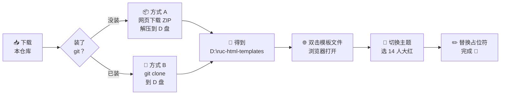
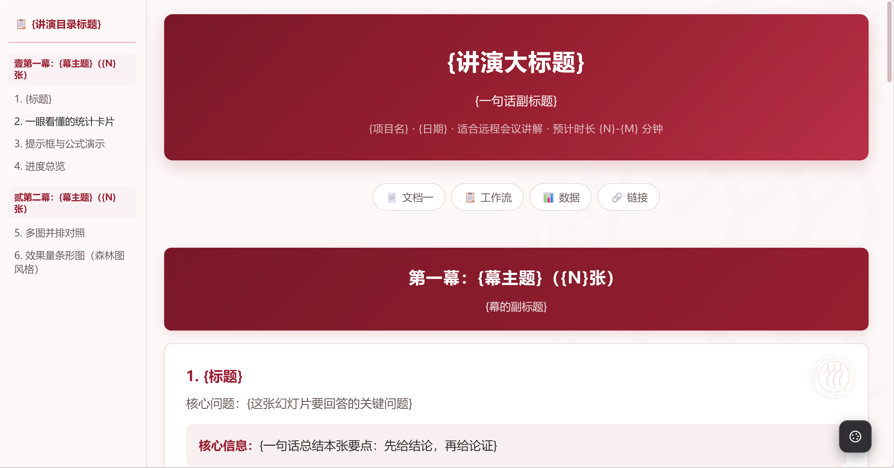
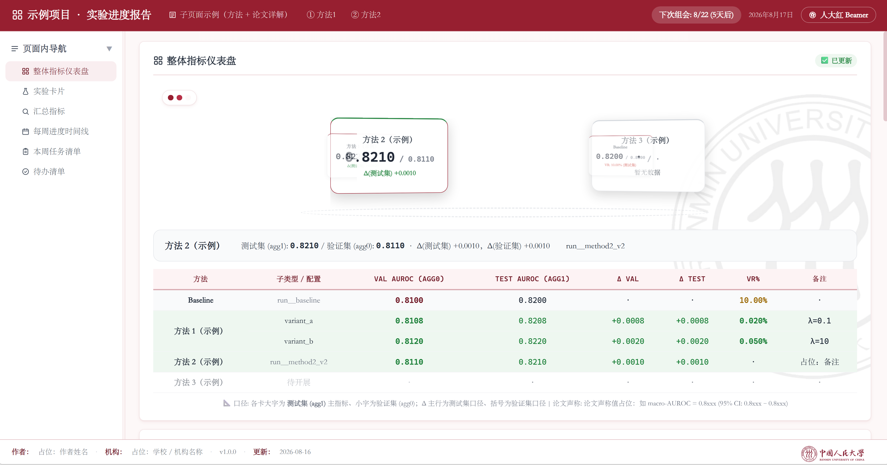
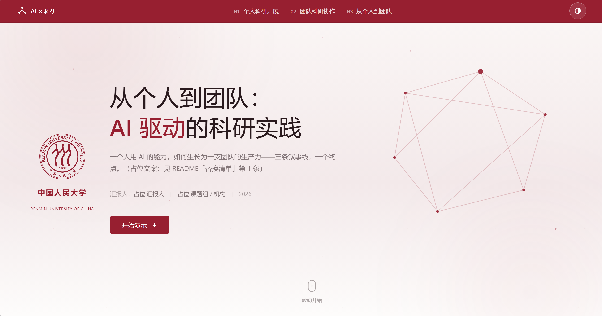
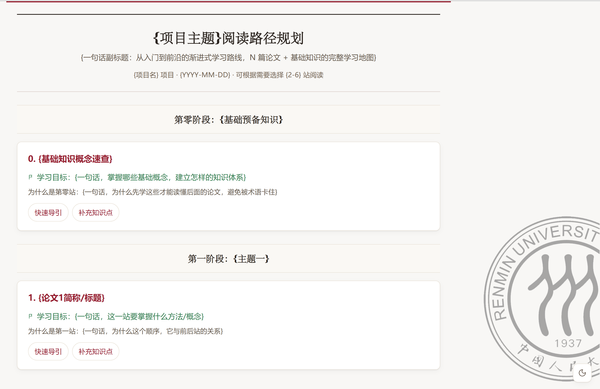
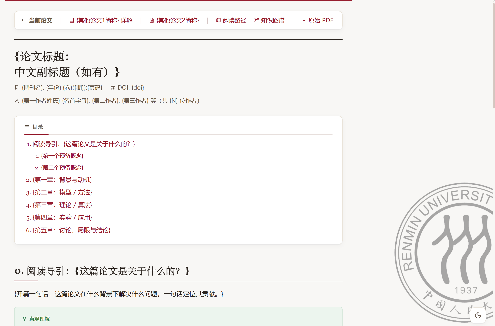
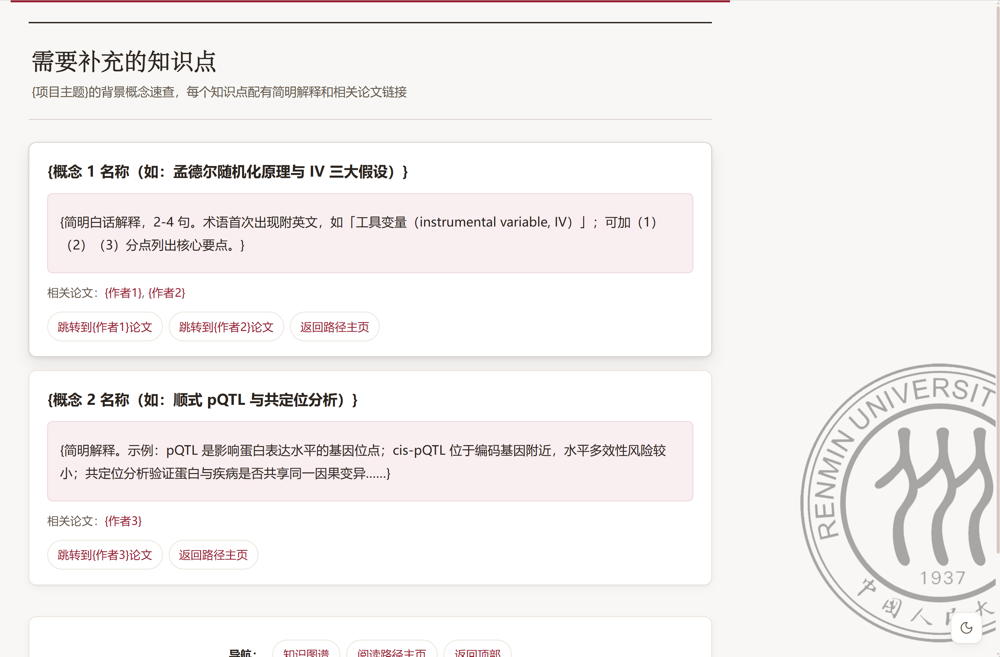
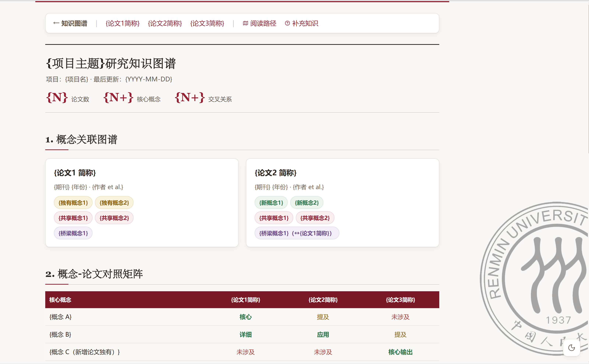
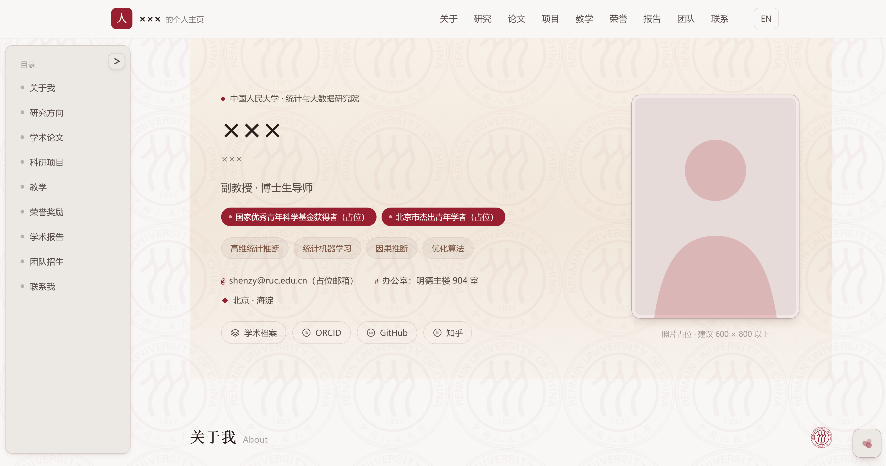

# 🎓 RUC-HTML-Templates · 中国人民大学风格网页汇报模板集

一套**纯静态、零构建依赖**的 HTML 网页模板集，覆盖科研工作的五类典型场景：**课程/学术讲演**、**组会进度汇报**、**对外商业汇报**、**论文精读解析**、**个人学术主页**。

> 📊 **关键数字一览**
> - 🧩 **5 个模板**：lecture 讲演 / lab-meeting 组会 / commerical-lecture 商业 / paper-explainer 论文解析 / personal-homepage 学术主页
> - ⚡ **3 个双击即用**：lecture、paper-explainer、personal-homepage 无需任何工具，双击 HTML 文件即可在浏览器打开
> - 🎨 **77 套主题**：每个模板内置 7~34 套风格，页面角落一键切换、选择自动记忆
> - 🏫 **人大红主题特色**：全部模板均带中国人民大学官方视觉主题——校徽红 `#971f30`、官方校徽与背景水印、宋体衬线标题，复刻自学校官方 LaTeX Beamer 模板与官网 VI 素材


> ⚖️ **使用许可**：本仓库采用「**非商业署名许可**」（见根目录 `LICENSE`）。同学用于课程作业、学术汇报、个人主页等**非商业场景**均可免费使用，只需在作品显著位置署名并标注出处；**任何商业使用须先联系作者取得授权**（邮箱见[第 14 节 · 作者信息](#sec-14)）。

> ⭐ **如果这套模板帮到了你，请在 Gitee 仓库页面右上角点一个 Star**——这是对作者最直接的支持，也欢迎将该项目分享给身边的同学，让更多同学看到并使用这个仓库。谢谢！

所有模板均为原生 HTML + CSS + JavaScript，**不需要安装 Node.js、不需要 npm install、不需要任何构建步骤**——会用浏览器就会用，会改文字就会定制。专为不熟悉前端开发的科研工作者（尤其是人文社科背景的同学）设计。

> 🌐 **浏览器推荐：Microsoft Edge**
> 模板在 Microsoft Edge 下经过最完整的测试（渲染、主题切换、交互、打印导出均逐一验证），**推荐优先使用 Edge 打开**。Chrome / Firefox 等现代浏览器通常也能正常使用，但个别效果（如部分毛玻璃、滚动高亮、打印分页）在不同浏览器上可能存在细微差异；若遇到显示异常，请先换用 Edge 再试。

---

## 📑 目录

- [1. 🏫 项目简介](#sec-1)
- [2. 🧭 模板总览（选哪个？）](#sec-2)
- [3. 🚀 快速开始](#sec-3)
- [4. 📖 实战案例：五分钟上手 lecture 模板](#sec-4)
- [5. 🎤 模板一：lecture · 讲演幻灯片模板](#sec-5)
- [6. 🔬 模板二：lab-meeting · 组会汇报模板](#sec-6)
- [7. 🤝 模板三：commerical-lecture · 商业汇报模板](#sec-7)
- [8. 📄 模板四：paper-explainer · 论文解析模板](#sec-8)
- [9. 🏠 模板五：personal-homepage · 个人学术主页模板](#sec-9)
- [10. ✏️ 写给不熟悉 HTML 的同学：十分钟看懂网页模板](#sec-10)
- [11. 🤖 用 AI Agent 帮你修改模板](#sec-11)
- [12. ❓ 常见问题（FAQ）](#sec-12)
- [13. 📦 仓库附属资源](#sec-13)
- [14. 👤 作者信息](#sec-14)

---

<a id="sec-1"></a>

## 1. 🏫 项目简介

做科研离不开「汇报」与「展示」：组会上讲进度、课堂上讲课、论文分享会上讲文献、向合作方/甲方展示能力、系统精读一个领域的文献、乃至给自己搭一个学术主页。PPT 之外，**网页是一种更有表现力的载体**——它可以侧边目录导航、主题一键换肤、放交互式图表、滚动讲演，且天然适合远程会议共享屏幕。

本仓库把多份实际使用过的成熟页面提炼为五个通用模板：

| 你要做的事 | 用哪个模板 | 入口 |
|---|---|---|
| 🎤 讲一门课 / 做学术报告 / 论文解读 / 复现汇报 | **lecture**（讲演幻灯片） | `html-templates/lecture/slide_deck_template.html` |
| 🔬 组会汇报每周进度 / 管理方法与论文笔记 | **lab-meeting**（组会汇报站） | `html-templates/lab-meeting/index.html` |
| 🤝 向企业、合作方做能力展示 / 商业路演 | **commerical-lecture**（商业演示页） | `html-templates/commerical-lecture/index.html` |
| 📄 精读文献 / 深入浅出讲透一篇或多篇论文 | **paper-explainer**（论文解析站） | `html-templates/paper-explainer/nav/reading_path_template.html` |
| 🏠 搭建自己的学术主页（教师/博士/硕士均适用） | **personal-homepage**（个人学术主页） | `html-templates/personal-homepage/index.html` |

五个模板共享同一套设计哲学：

- 🎨 **人大红主题**：每个模板都内置中国人民大学官方视觉风格（校徽红 `#971f30`、校徽、背景水印、宋体衬线标题），复刻自学校官方 LaTeX Beamer 模板 `RenminUniv.sty` 与官方视觉识别素材；
- 🌈 **多主题一键切换**：除人大红外各有 7~34 套风格主题（WWDC 发布会风、东方水墨、学科专属装饰等），页面角落有切换按钮，选择自动记忆；
- 🗂 **数据与样式分离**：lab-meeting 与 commerical-lecture 的文案内容放在 `web_data/` 的 JSON 文件里，改内容不用碰网页代码；
- ⚡ **零外部依赖**：lecture、paper-explainer、personal-homepage 三个模板双击即可在浏览器打开，完全离线可用（无网络字体、无 CDN）。

<a id="sec-2"></a>

## 2. 🧭 模板总览（选哪个？）

| | 🎤 lecture 讲演 | 🔬 lab-meeting 组会 | 🤝 commerical 商业 | 📄 paper-explainer 论文解析 | 🏠 personal-homepage 学术主页 |
|---|---|---|---|---|---|
| **形态** | 单长页面，"幕 + 卡"滚动讲演 | 总览页 + N 个子页面的小站 | 滚动 + 翻页混合演示页 | **四类页面互联**的论文解析站 | 单页个人学术主页 |
| **打开方式** | ✅ 双击直接打开 | 需本地服务器（一条命令） | 需本地服务器（一条命令） | ✅ 双击直接打开 | ✅ 双击直接打开 |
| **内容放哪** | 直接写在 HTML 里 | `web_data/` JSON 数据文件 | `web_data/` JSON 数据文件 | 直接写在 HTML 里（或由技能生成） | 直接写在 HTML 里（中英成对） |
| **主题数** | 17 套 | 11 套 | 7 套 | 8 套 | **34 套**（16 学科 × 浅/深 + 人大红 × 2） |
| **特色功能** | 侧边目录自动生成、MathJax 公式、导出 PDF | 3D 方法转盘、每周时间线、倒计时、折叠面板 | 翻页笔翻页、产品点击放大、构建过程联动 | 7 种标注盒、知识图谱、阅读路径、背景知识词典 | 全页内容随学科切换、中英双语、BibTeX 一键复制 |
| **适合** | 一次性讲演（15–50 分钟） | 常驻站点，每周更新 | 一次性对外演示（20–30 分钟） | 持续积累的文献精读库 | 长期维护的个人主页 |

> 💡 **不确定选哪个？** 先做一次 30 秒判断：要「像 PPT 一样从头讲到尾」→ lecture；要「每周更新、持续积累」→ lab-meeting；要「对外的门面演示」→ commerical-lecture；要「把论文讲透、越读越多」→ paper-explainer；要「一个属于自己的学术门面」→ personal-homepage。

<a id="sec-3"></a>

## 3. 🚀 快速开始

### 🧰 环境要求

- 任意现代浏览器（Edge / Chrome / Firefox 均可）；
- Python 3（仅 lab-meeting 与 commerical-lecture 需要，用于启动本地服务器；Windows/macOS/Linux 一般自带，终端输入 `python --version` 可检查）。

### 方式 A：lecture / paper-explainer / personal-homepage（最简单，双击即用）✨

这三个模板**无任何外部依赖**，直接双击 HTML 文件即可在浏览器打开：

1. lecture：双击 `html-templates/lecture/slide_deck_template.html`；
2. paper-explainer：双击 `html-templates/paper-explainer/nav/reading_path_template.html`（从阅读路径页进入，顺着链接可以逛完全部四类页面）；
3. personal-homepage：双击 `html-templates/personal-homepage/index.html`。

### 方式 B：lab-meeting / commerical-lecture 模板（需启动服务器）

这两个模板的文案放在 JSON 文件里，网页通过 `fetch()` 读取——浏览器的安全策略禁止网页直接读取本地文件，所以**必须走 HTTP 服务器**，直接双击 index.html 只能看到「数据加载失败」提示。

```bash
# Windows（在开始菜单搜 "PowerShell" 或 "cmd" 打开终端）
cd D:\RUC-html-templates\html-templates\lab-meeting
python -m http.server 8080

# 然后浏览器打开 http://localhost:8080
```

关闭方式：在终端按 `Ctrl + C`。改完 JSON 保存后，浏览器按 `F5` 刷新即可看到效果。

<a id="sec-4"></a>

## 4. 📖 实战案例：五分钟上手 lecture 模板

以一位同学第一次使用本仓库为例，从零到看到网页渲染效果，全程不需要写任何代码。

先看整体路线图（第一个分岔取决于你电脑上有没有装 git，之后是线性四步）：



**第 1 步 · 下载仓库** 📥

先把整个仓库下载到你的电脑上。有两种方式，**任选其一即可**（没装 git 的同学直接用方式 A）：

**方式 A：网页下载 ZIP（推荐，不需要安装任何软件）** 📦

1. 用浏览器打开本仓库的 Gitee 页面（也就是你正在看这份 README 的页面）；
2. 点击页面右侧的绿色「**克隆/下载**」按钮；
3. 在弹出的面板中选择「**下载 ZIP**」——浏览器会把整个仓库打包成一个压缩包，下载到你的「下载」文件夹（文件名类似 `ruc-html-templates.zip`）；
4. 打开「文件资源管理器」（按键盘 `Win + E`），进入「下载」文件夹，找到这个压缩包；
5. 在压缩包上**右键 →「全部解压缩」（Extract All）**，目标位置填 `D:\`，点击「解压缩」；
6. 解压完成后，D 盘下会出现一个 `ruc-html-templates` 文件夹（名字可能带有少量后缀，不影响使用）——这就是下载好的完整仓库。

**方式 B：git clone（需要电脑上已安装 git）** 🌿

git 是程序员常用的版本管理工具，**普通同学的电脑上通常没有安装**。不确定自己装没装？在终端（Windows 按 `Win + R`，输入 `powershell` 回车打开)里输入 `git --version` 回车：显示出 `git version 2.xx.x` 就是装了；提示「无法将 git 识别为 cmdlet…」就是没装——没装就用上面的方式 A，或者先去 [git-scm.com/downloads](https://git-scm.com/downloads) 下载安装（安装时一路「下一步」默认选项即可）。

装好 git 后，在终端里逐行输入下面两条命令（第一行是进入 D 盘，第二行是把仓库下载到 D 盘下、自动创建 `D:\ruc-html-templates` 文件夹）：

```bash
cd D:\
git clone https://gitee.com/AiALi7-9-22/ruc-html-templates.git D:\ruc-html-templates
```

回车后等进度走完，D 盘下就会出现 `ruc-html-templates` 文件夹。

> ⚠️ 请下载**整个仓库**而不是只拿单个文件：`slide_deck_template.html` 依赖同目录的 `theme-pack.js`（主题包），目录结构被打乱会导致主题切换失效。

**第 2 步 · 用浏览器打开模板** 🌐

打开第 1 步得到的文件夹（如 `D:\ruc-html-templates`），依次进入 `html-templates` → `lecture` 文件夹，**直接双击 `slide_deck_template.html`**——浏览器会立刻渲染出完整的讲演网页：

- 左侧自动生成讲演目录，点击可平滑跳转，滚动时自动高亮当前位置；
- 页面从上到下是「封面 → 第一幕 → 若干幻灯片卡 → 第二幕 → … → 页脚」的讲演结构；
- 右下角有一个**主题切换方块**，点开是 17 套主题的选单。

> 💡 如果双击后用记事本/编辑器打开了文件（而不是浏览器），在该文件上**右键 → 打开方式 → 选择 Edge/Chrome** 即可。

**第 3 步 · 切换到人大红主题** 🎨

点击右下角切换方块，选择「**14 人大红 Beamer**」——整页瞬间变成校徽红 `#971f30` 底色 + 校徽 + 背景水印 + 宋体衬线标题的人大官方风格。选择会自动记忆，刷新、下次打开仍然保持。

**第 4 步 · 变成你自己的讲演** ✏️

用任意文本编辑器（记事本即可）打开 `slide_deck_template.html`，搜索 `{`（花括号）找到全部占位符，替换成你的标题、日期、正文；每张幻灯片卡按「核心问题 → 核心信息 → 论证 → 出处」的结构填内容。保存、浏览器 `F5` 刷新，讲演页就属于你了。

之后想深入（加一页、换组件、嵌公式），继续阅读第 5 节与模板自带的 `slide_deck_template_guide.md`。

<a id="sec-5"></a>

## 5. 🎤 模板一：lecture · 讲演幻灯片模板

<p align="center">
  
</p>
<p align="center"><em>lecture 模板在人大红 Beamer 主题下的渲染效果（右下角方块可切换其余 16 套主题）</em></p>

**位置**：`html-templates/lecture/`（详细说明见 `slide_deck_template_guide.md`，与模板配套）

### 5.1 ⭐ 功能特点

- 📄 **自包含单文件**：一个 HTML 文件包含全部样式与交互，双击浏览器打开即用，无任何外部依赖（公式库 MathJax 可选，不需要可删）；
- 🎬 **幕 + 卡结构**：页面用「幕」（章节 `.act-header`）组织成 3~5 大块，每「张幻灯片」是一张卡片 `.slide`，每张卡自带「核心问题 → 核心信息（先给结论）→ 论证 → 出处」的表达模板；
- 🧭 **侧边目录自动生成**：无需手写目录，页面底部 JS 自动提取各幕与各卡标题生成目录，点击平滑跳转，滚动时自动高亮当前位置；
- 🌈 **17 套主题一键切换**：右下角方块按钮展开主题面板，点选即换肤，选择保存在浏览器里（刷新、换页后仍保持）；
- 🧰 **内置讲演组件库**：三色提示框（核心/警告/成功）、统计卡片、语义徽章（✅通过/⚠️接近/✗失败/🔒阻塞）、进度条、着色数据表、森林图（用表格字符模拟"点估计+区间"，不截图也清晰）、图文网格、MathJax 数学公式；
- 🖨 **可导出 PDF**：浏览器 `Ctrl+P` → 另存为 PDF，长页面自动分页，相当于生成讲义。

### 5.2 🎨 主题一览（节选）

| 编号 | 主题 | 风格 |
|---|---|---|
| 默认 | 📘 通用蓝系 | 清爽学术蓝，正式场合稳妥之选 |
| 01 | 🌑 深色奢华 Dark Premium | 路演/发布会气场 |
| 02 | 🤍 极简留白 Minimal | 高级咨询风 |
| 03 | 🪟 玻璃拟态 Glassmorphism | 渐变科技风 |
| 05 | 🖌 东方水墨 Ink | 宣纸 + 朱砂印章 |
| 10 | 💻 赛博终端 Terminal | 代码演示场景 |
| 13 | 📐 瑞士网格 Swiss Grid | 强网格排版 |
| **14** | 🏫 **人大红 Beamer** | **官方 LaTeX 模板网页复刻：校徽红 #971f30 + 校徽 + 背景水印 + 宋体衬线** |
| 15/16 | 🍎 WWDC 深色/亮色 | 苹果发布会风 |

16 个风格变体的对比预览页：`html-templates/lecture/style_previews/index.html`（双击打开，逐个挑选）。

### 5.3 🛠 使用步骤（10 分钟完成改造）

1. 复制 `slide_deck_template.html` 改名为 `{你的讲演名}.html`（若移动位置，把 `theme-pack.js` 一起复制走）；
2. 浏览器打开，右下角切换方块挑主题；要**固定默认主题**（如人大红），把 `<html>` 与 `<body>` 标签里的 `data-default-theme="default"` 改成 `data-default-theme="14"`；
3. 改封面：`<header>` 里的大标题、副标题、日期、预计时长；
4. 替换内容：每张 `.slide` 卡片的标题、核心信息框、正文、表格、出处链接；要加一页就整块复制一张 `.slide`，要加一章就复制一个 `.act-header` + 若干卡片；
5. 改页脚 `<footer>` 的项目归属信息；
6. 确认所有 `{花括号占位符}` 都已替换，浏览器预览检查目录跳转与主题切换正常。

<a id="sec-6"></a>

## 6. 🔬 模板二：lab-meeting · 组会汇报模板

<p align="center">
  
</p>
<p align="center"><em>lab-meeting 组会汇报站在人大红 Beamer 主题下的总览页（顶栏调色板按钮可切换其余 10 套主题）</em></p>

**位置**：`html-templates/lab-meeting/`（详细说明见其目录下 `README.md`）

### 6.1 ⭐ 功能特点

- 🏗 **一套站点 = 总览页 + N 个子页面**：总览页是组会汇报主页；每个研究方法/精读论文单独一个子页面（复制 `01_example_method/` 目录改名即可）；
- 🗂 **数据驱动**：基线指标、方法列表、每周进度、待办清单全部放在 `web_data/report_data.json`——**每周更新进度只需改 JSON，网页代码一行不用动**；
- 🎡 **3D 方法转盘**：总览页把各方法渲染成可自动旋转、可拖拽、可点击选中的 3D 圆环，选中卡片详情实时显示在转盘下方；
- 🧪 **实验卡片体系**：每个实验方向一张卡，卡内左右两栏（左图表、右文字解释），细节图表默认折叠、点击展开，避免信息过载；
- 📅 **每周时间线**：当前周高亮脉冲、未来周虚线、历史周折叠；顶部导航有**下次组会倒计时**（自动按数据里的日期计算）；
- 📄 **论文详解工作流**：子页面示范了展示论文公式的标准做法——用 PDF 解析工具把论文公式导出为图片，页面按「公式截图 + 编号图注 + 文字解读」逐条展示，无需手写 LaTeX 转写；
- 🗑 **失败实验也归档**：子页面有专门的「失败/错误实验归档」卡片，证伪同样是进展；
- 🌈 **11 套主题一键切换**：调色板按钮在顶部导航右侧，选择跨页连续（在子页面切到水墨风，返回总览仍是水墨风），含**人大红 Beamer**（`11_ruc_beamer`）。

### 6.2 📂 目录结构

```
lab-meeting/
├── index.html                 ← 总览页模板（默认蓝系主题，唯一必须页面）
├── theme-pack.js              ← 主题包（11 个主题的唯一数据源）
├── 01_example_method/         ← 子页面模板（方法页/论文页，复制整个目录后改名）
├── themes/                    ← 10 个主题变体 + 预览入口 index.html
├── web_data/
│   ├── report_data.json       ← 数据源（必须）：基线/方法/每周进度/待办
│   ├── metrics_summary.json   ← 汇总指标（可选，缺失时该卡自动隐藏）
│   └── schema.md              ← 字段字典（改 JSON 前先查这个）
└── assets/                    ← 校徽等素材
```

### 6.3 🛠 典型使用场景

**📅 每周更新进度（最常用）**：只改 `web_data/report_data.json`——`weekly_progress` 追加新的一周（`saturday` 填下次组会日期，倒计时自动更新）、把完成的项从 `todo_list` 归档。HTML 完全不动。

**🏗 新建整个站点**：复制整个 `lab-meeting/` 目录 → 改 `index.html` 的项目名 → 复制 `01_example_method/` 为你的每个方法/论文建子目录 → 填 `report_data.json` → 启动服务器预览。

> ⚠️ **注意**：新增实验卡片或子页面小节时，导航条目需要同步多处配置（详见该目录 README 的「三处同步」清单），这是本模板最主要的坑。

<a id="sec-7"></a>

## 7. 🤝 模板三：commerical-lecture · 商业汇报模板

<p align="center">
  
</p>
<p align="center"><em>commerical-lecture 商业演示页在人大红主题下的首页（顶栏半月按钮可切换其余 6 套主题）</em></p>

**位置**：`html-templates/commerical-lecture/`（详细说明见其目录下 `README.md` 与 `DESIGN.md`）

### 7.1 ⭐ 功能特点

- 🎯 **定位**：面向潜在合作方（企业、甲方）的能力汇报演示网页，以叙事线展开（示例为三条线：个人科研开展 → 团队科研协作 → 从个人到团队，可自行改成任意叙事结构）；
- 🎬 **混合式演示形态**：开场自然滚动（全屏 Hero + 叙事轴）→ 中段三章进入**翻页模式**（像 PPT 一样一页一页讲）→ 收尾自然滚动（合作邀约 + 页脚）；
- 🎮 **多种翻页方式**：滚轮、键盘（PageDown/方向键/空格）、**翻页笔**、触屏滑动、屏幕按钮均可翻页——现场演示时翻页笔直接可用；
- 🖼 **产品展示交互**：产品截图悬停预览、**点击放大**、产品分页浏览；右侧「构建过程」面板与所选产品**联动**（点产品 F，四步构建过程自动切换为 F 的内容）；
- 🌈 **7 套主题一键切换**（顶栏半月按钮，刷新保持）：夜航 Twilight（默认）、晨雾 Dawn、蓝图 Blueprint、宣纸 Ink、星图 Starmap、墨夜 Nocturne、**人大红 RUC**（红底顶栏 + hero 竖版校徽组合 + 官方标准字排版）；
- 🗂 **文案全部外置**：`web_data/content.json` 是唯一文案源，替换占位内容不需要改任何代码，页面结构自动适配（如每条线只填 1 个 skill 时，该章自动少一页）。

> 🔧 **近期修复**：产出页「点击产品卡片可放大查看」的交互提示曾与标题文字互相遮挡，现已修复——无论点击前、放大后还是滚动到任意位置、窄屏矮屏，提示文字都不会再遮挡产品截图与「产出与构建」标题（多视口几何验证通过）。

### 7.2 🛠 使用步骤

1. 启动服务器并打开页面（见第 3 节方式 B）；
2. 按「替换清单」改 `web_data/content.json`（字段字典见 `web_data/schema.md`）：
   - `meta`：汇报标题、汇报人、机构、日期；
   - `overview`：导语 + 三格能力数据；
   - `lines[0..2]`：每条叙事线的标题、导语、1–2 个 skill、产出产品（名称/描述/截图路径）、四步构建过程；
   - `closing`：合作邀约文案与按钮；
3. 把真实产品截图放入 `assets/`，在 `shot` 字段填路径（不填则显示占位框）；
4. 汇报场景以人大为主时，把 `<body data-default-theme="twilight">` 改为 `data-default-theme="ruc"`，页面默认以人大红打开。

<a id="sec-8"></a>

## 8. 📄 模板四：paper-explainer · 论文解析模板

**位置**：`html-templates/paper-explainer/`（详细说明见 `paper_explainer_template_guide.md`，与模板配套）

这是一套专为**论文精读与解析**设计的模板：把一个领域里读过的论文，深入浅出地讲给读者（也讲给未来的自己）。它不是一个页面，而是**四类互相链接的页面**组成的解析站——从「按什么顺序读」到「每篇怎么讲」再到「概念从哪查」，形成完整的文献学习闭环。

> 🤖 **与论文解析技能强相关**：本模板与作者自创的 **paper-explainer 论文解析技能**深度绑定——**把一篇论文 PDF 交给该技能，可以直接生成符合本模板规范的完整论文详解页面**（含章节拆解、标注盒、原图截图与图注、交叉引用），无需手写 HTML。想要这个技能的同学，欢迎**邮件联系作者**（邮箱见[第 14 节 · 作者信息](#sec-14)）。

### 8.1 🖼 四类页面与截图对照

下面四张截图分别对应模板的四个页面模板，也正好是一套解析站的完整拓扑：

**① 阅读路径页**（导览门户）

<p align="center">
  
</p>
<p align="center"><em>对应模板：<code>nav/reading_path_template.html</code>——用「阶段分隔条 + 步骤卡片」把多篇论文组织成渐进式学习路线，每站标注「学什么 + 为什么在这一站」，并链接到对应论文详解页与背景知识页。新读者从这里入门。</em></p>

**② 论文详解页**（核心页面）

<p align="center">
  
</p>
<p align="center"><em>对应模板：<code>papers/paper_explainer_page_template.html</code>——逐章深入浅出讲解一篇论文。图中可见期刊刊头式页眉、顶部阅读进度线、以及模板最核心的<strong>七种彩色标注盒</strong>：直观理解（绿）→ 正式定义（蓝）→ 具体示例（琥珀）→ 定理结论（紫）→ 算法（等宽字体）→ 要点总结（淡蓝）→ 注意事项（红），另有原论文图截图卡片与出处边注。</em></p>

**③ 背景知识页**（随行词典）

<p align="center">
  
</p>
<p align="center"><em>对应模板：<code>nav/knowledge_supplement_template.html</code>——集中速查论文中反复出现、但正文不展开的背景概念；每个概念一张卡片 + 定义框，并回链到出现该概念的论文。读到不懂的名词时来这里查。</em></p>

**④ 知识图谱页**（关联中枢）

<p align="center">
  
</p>
<p align="center"><em>对应模板：<code>knowledge_graph_template.html</code>——把多篇论文的概念关联组织成五大板块：概念关联图谱（每篇论文一个节点）、概念×论文对照矩阵、论文间关系卡片、推荐阅读顺序、全部论文索引。读得越多，这张图越有价值。</em></p>

四类页面的链接关系：

```
阅读路径页（导览门户）
   ├─→ 论文详解页 × N（每篇论文一页）
   ├─→ 背景知识页（随行词典，概念回链论文）
   └─→ 知识图谱页（跨论文关联中枢）
```

### 8.2 ⭐ 功能特点

- 🗞 **学术纸感视觉**：期刊刊头式页眉（顶部粗规线 + 衬线标题）、冷调纸白底色、墨蓝重音，内容优先、克制不花哨；
- 🖍 **七种标注盒**：按「直觉 → 定义 → 示例 → 总结」三层展开组织讲解，每种盒子一个颜色，读者一眼分清「这是白话直觉还是严格定义」；
- 🧭 **三级相关性防孤立**：新论文加入时，按与已有论文的相关性强弱分级插入交叉引用（顶部导航 / 正文交叉引用 / 底部资源栏），论文之间不孤立、不硬造关系；
- 🌈 **8 套明暗主题一键切换**：纸墨（默认）、**人大红**（校徽红规线 + 右下角校徽水印 + 官方 favicon）、素墨、青瓷、墨夜、深海、磷光终端、暮紫；选择跨四个页面连续保持；
- 🧮 **MathJax 公式支持**（论文详解页，不需要可删）；
- 📴 **双击即用**：无网络字体、零外部依赖，离线 `file://` 直接打开。

### 8.3 🛠 使用步骤

1. **双击打开** `nav/reading_path_template.html`，点右下角切换方块挑主题（推荐 `02 人大红`）；
2. 按论文详解页的占位结构写你的第一篇详解：复制 `papers/paper_explainer_page_template.html`，按命名规范改名（`{第一作者姓}_{年份}_{标题前三个实义词}_zh.html`），逐节替换标题、标注盒正文、原图截图；
3. 在阅读路径页加一个「步骤卡片」指向你的新详解页；
4. 读第二篇、第三篇时，同步更新知识图谱页的五个板块与背景知识页的概念卡（指南第七节有清单）；
5. 整个 `paper-explainer/` 目录可整体拷走使用；单独拷某一页时，记得一并带上 `theme-pack.js`（要主题切换）与 `ruc-mark.svg` + `background-1.png`（要人大红校徽效果）。

<a id="sec-9"></a>

## 9. 🏠 模板五：personal-homepage · 个人学术主页模板

<p align="center">
  
</p>
<p align="center"><em>personal-homepage 个人学术主页在人大红主题下的渲染效果（右下角方块可切换全部 34 套主题，顶栏可切换中英双语）</em></p>

**位置**：`html-templates/personal-homepage/`（详细说明见其目录下 `README.md`）

面向高校教师、博士生、硕士生的**个人学术主页**模板。它最大的特点是：**页面风格与学科绑定**——不是简单换个配色，而是每个学科一整套专属的视觉语言与示例内容，**人文社科、理工经管各学科的同学都能找到自己的主题**。

### 9.1 🎓 16 个学科 × 浅色/深色 + 人大红 = 34 套主题

每套学科主题都有**专属装饰母题**（参照该学科的标志性符号手绘的统一线条风 SVG），且**全页内容随学科切换**——切到数学主题，连论文列表、研究兴趣、课程都会变成数学方向的示例内容，方便你参照同学科的范例填写：

| 学科 | 装饰母题（节选） | 学科 | 装饰母题（节选） |
|---|---|---|---|
| 🔢 数学 | 欧拉恒等式、方格纸 | 📰 新闻传播 | 报纸版式、广播塔 |
| ⚛️ 物理 | 薛定谔方程、原子轨道 | 🕸 社会学 | 网络节点 |
| 🏛 政治学 | 讲台列柱、国会穹顶 | 🦉 哲学 | Ω 同心环 |
| ⚖️ 法学 | 天平、法槌 | 🏺 历史学 | 青铜鼎、线装书 |
| 📈 经济学 | 供需曲线、无差异曲线 | 🧪 化学 | 烧瓶、苯环 |
| 🤖 人工智能 | 神经网络节点、点阵 | 🧬 生物学 | DNA 双螺旋 |
| 📊 统计学 | 正态密度曲线、箱线图 | 🏢 工商管理 | 组织结构图 |
| 📜 文学 | 竹简、宣纸、竖排诗句 | 💹 金融学 | K 线烛图 |

另有**人大红浅色/深色**两套（默认打开）：只使用官方视觉识别素材——官方校徽（红色版 + 反白版）+ 极淡校徽纹样背景 + 校徽红 `#971f30`。

### 9.2 ⭐ 功能特点

- 🗂 **11 个学术版块**：单位与简介、研究兴趣、教育/工作经历、研究方向、学术论文（按年份分组、**BibTeX 一键复制**、本人姓名高亮）、科研项目、教学、荣誉奖励、学术报告、团队与招生、联系方式；
- 🌏 **中英双语一键切换**：所有文案中英成对书写，顶栏按钮切换，选择自动记忆——申请海外职位、国际交流时直接用英文版；
- 📑 **左侧可折叠目录**：宽屏显示，点击跳转 + 滚动高亮当前阅读位置，主题色背景卡片，可折叠收起；
- 📴 **双击即用、离线可用**：无网络字体（大陆网络环境无忧）、零外部依赖，全部素材随包分发；
- 📱 **移动端适配**：顶栏折叠为汉堡菜单，目录自动隐藏。

### 9.3 🛠 使用步骤

1. **双击打开** `index.html` 预览，右下角方块挑你的学科主题（如法学 → `09 法学·浅`）；
2. 用文本编辑器打开 `index.html`，按目录 `README.md` 的「**替换清单**」逐项替换：姓名与头衔、单位、照片（建议 3:4）、简介、教育/工作经历、论文列表（把 `href="#"` 占位链接换成真实 PDF/DOI 地址）、BibTeX、项目、课程、页脚备案号；
3. 参考你所在学科的示例内容写法（切到该学科主题即可看到全套示例）；
4. 顶栏「中 / EN」检查双语两版都通顺；
5. 部署到 Gitee Pages / GitHub Pages 或校园服务器，就拥有了你的学术主页。

<a id="sec-10"></a>

## 10. ✏️ 写给不熟悉 HTML 的同学：十分钟看懂网页模板

**你不需要会「写」网页，只需要会「找到并替换」文字。** HTML 文件就是普通文本文件，用记事本、VS Code、乃至任何编辑器都能打开。以下是最小必要知识。

### 10.1 👀 HTML 长什么样

网页内容被**标签**包裹，标签成对出现（开始 + 结束）：

```html
<h1>我的研究报告</h1>          ← 一级标题
<p>这是一段正文文字。</p>       ← 一个段落
<div class="slide">…</div>     ← 一个区块（这里是"一张幻灯片"）
      ← 一张图片，src 是图片文件的位置
<a href="https://…">链接文字</a> ← 一个超链接
```

标签本身控制结构，**你通常只改标签之间的文字**。形如 `{花括号}`、`（在此填写……）`、`占位：…` 的就是留给你的填空处。

### 10.2 🔧 三个最常用的修改

| 想改什么 | 怎么做 |
|---|---|
| ✏️ **改文字** | 在编辑器里 `Ctrl+F` 搜到那句话（或它的占位符），直接替换标签之间的文字。注意别删到两侧的 `<…>` 标签本身 |
| 🖼 **换图片** | 把你的图片文件放进模板的 `assets/` 文件夹，然后找到 ``，把 `src` 改成新路径（如 `assets/我的图.png`） |
| 🗃 **改数据（lab-meeting / commerical-lecture）** | 打开 `web_data/` 下的 JSON 文件改文字和数字。JSON 语法要点：字符串加**英文双引号**、每行末尾的逗号**只能多不能少**（最后一项后面不写逗号）、改完保存为 UTF-8 编码 |

改完保存 → 浏览器 `F5` 刷新查看。**改坏了不要慌**：这是 git 仓库，随时可以还原到上次提交的版本；改之前也可以先复制一份备份。

### 10.3 🚧 哪些东西建议不要动

- 🔒 `themes/`、`style_previews/` 下的网页文件是**脚本自动生成的产物**，手改会被下次构建覆盖——改主题请改 `theme-pack.js`（五个模板共用这一模式：**theme-pack.js 是主题的唯一数据源**）；
- 🧠 `<head>` 里 `<style>`、`<script>` 区块是样式与逻辑，不确定时整块跳过不读；
- 🏫 人大红主题的校徽、水印图片路径改了会挂图，替换素材时保持原文件名最省事；
- 📖 各模板目录下的 `README.md`、`schema.md`、指南 md 是使用手册与数据字典，遇到「这个字段什么意思」先查它们。

### 10.4 ✅ 检查清单（改完过一遍）

- [ ] 所有占位符（`{…}`、`占位：…`、`href="#"`）已替换干净
- [ ] 图片在浏览器里正常显示（不显示 = 路径写错，检查文件名与后缀）
- [ ] 中文引号/英文引号没有混用导致 JSON 解析失败（lab-meeting 总览页空白通常是 JSON 语法错误，可用 `python -c "import json; json.load(open('web_data/report_data.json', encoding='utf-8'))"` 验证）
- [ ] 侧边目录/导航点击跳转正常、主题切换正常
- [ ] 页脚的姓名、日期已更新

<a id="sec-11"></a>

## 11. 🤖 用 AI Agent 帮你修改模板

如果你不想手动改 HTML，**AI 编程助手（AI Agent）是目前门槛最低的定制方式**：把模板交给它，用自然语言描述你要什么，它来改代码。推荐工具：

- 🤖 **Claude Code**（Anthropic 出品的终端编程助手，本项目模板即在其协助下制作与维护）；
- 🔮 Cursor、WindSurf 等 AI 编辑器，或直接把 HTML 文件丢给 Claude / ChatGPT / DeepSeek 等对话模型（单文件模板如 lecture 与 personal-homepage 尤其适合这种方式）。

### 11.1 💬 典型用法与示例提示词

**📝 填内容**（最常见）：

> 我在用 `html-templates/lecture/slide_deck_template.html` 做一个讲演网页，主题是「清代赋税制度的区域差异」。请把封面标题、副标题改为以下内容：……（粘贴你的提纲）第一幕设为「制度背景」，包含 3 张幻灯片，内容分别讲……每张卡片按「核心问题 → 核心信息 → 论证」的结构组织。

**🎨 换主题**：

> 帮我把这个讲演页的默认主题固定为人大红 Beamer（14 号），并检查切换方块仍可用。

**➕ 加内容**：

> 在 lab-meeting 总览页新增一个实验卡片「实验二：问卷信度检验」，内容如下……请同步侧边栏导航和 JS 配置（注意此模板要求三处同步）。

**🔧 排错**：

> 我改了 `web_data/report_data.json` 之后页面变成空白，帮我检查 JSON 语法错误并修复。

### 11.2 ⚡ 进阶：paper-explainer 技能——让 AI 直接生成论文解析页

本仓库的作者还配套开发了一个 **paper-explainer 论文解析技能**（第 8 节模板就是它的产出规范）：把一篇论文 PDF 交给配置了该技能的 AI Agent，它会**自动完成**论文阅读、章节拆解、白话讲解、原图截取与图注、交叉引用，**直接生成一整套符合模板规范的解析网页**——详解页、知识图谱、阅读路径、背景知识页全部自动维护。

这是目前把「读论文 → 讲论文」自动化程度最高的用法。**该技能未随本仓库公开分发，需要的朋友请邮件联系作者**（邮箱见[第 14 节 · 作者信息](#sec-14)），附上你的使用场景即可。

### 11.3 ⚠️ 注意事项

- 🛟 **git 是你的安全网**：让 AI 改动前确认工作区干净（或先 `git commit`），改坏了一条 `git checkout -- 文件名` 即可还原；
- 📚 **给 AI 提供上下文**：把模板目录下的 `README.md` / `schema.md` / 指南 md 一并给它读，能显著减少它踩模板约定坑（如「不要手改变体文件」「数据字段含义」）；
- 👀 **人工验收不可省**：AI 改完后在浏览器里亲自过一遍——图片加载、导航跳转、主题切换、窄屏显示，这些只有肉眼能确认；
- 🐢 **渐进式修改**：一次让它改一处、验收一处，比一次大改更可控。

<a id="sec-12"></a>

## 12. ❓ 常见问题（FAQ）

**Q1：双击 index.html 打开后显示「数据加载失败」/页面空白？** 🫥
只有 lab-meeting 与 commerical-lecture 的数据靠 `fetch()` 加载，必须按第 3 节方式 B 启动本地服务器（`python -m http.server`）后通过 `http://localhost:…` 访问。lecture / paper-explainer / personal-homepage 三个模板无此限制，双击即用。

**Q2：为什么我切换的主题刷新后又变回去了？** 🔄
正常不会。主题选择存在浏览器的 localStorage 里，刷新保持、跨页连续。若你换了浏览器或使用了无痕模式，则不会记忆。

**Q3：能把网页变成 PPT / PDF 吗？** 🖨
可以。lecture 与 paper-explainer 模板浏览器 `Ctrl+P` → 另存为 PDF，长页面自动分页（建议先切好主题）。lab-meeting / commerical-lecture 是滚动/翻页网页形态，更适合现场直接演示。

**Q4：没有网络能用吗？** 📴
lecture / paper-explainer / personal-homepage 完全离线可用（若不需要公式，删除 head 里两个 MathJax `<script>` 即可实现零外部请求）。另两个模板的字体使用系统字体栈，离线可用，但同样需本地服务器。

**Q5：怎么把做好的网页分享给别人？** 📤
任意静态托管均可：GitHub / Gitee Pages、校园服务器、或直接把整个文件夹（保持目录结构）发给对方，对方本地起一个服务器打开。注意 `web_data/`、`assets/`、`theme-pack.js` 必须随网页文件一起带上。

**Q6：我想改人大红主题的细节（比如校徽位置）？** 🎨
改对应模板的 `theme-pack.js` 中该主题的 `css` 字段（唯一数据源），然后按各 README 说明重新生成变体。涉及学校视觉规范，建议对照仓库里的官方 VI 素材（见第 13 节）。

**Q7：我是人文社科的同学，personal-homepage 适合我吗？** 📚
非常适合——这正是它的设计初衷。16 个学科主题里有 10 个面向人文社科与管理（法学、文学、新闻传播、社会学、哲学、历史学、政治学、经济学、工商管理、金融学），每个学科都有专属装饰与全套示例内容，照着改即可。

**Q8：paper-explainer 的论文解析技能怎么获取？** 🤖
该技能由作者自研、未随仓库公开。请邮件联系作者（见[第 14 节 · 作者信息](#sec-14)），说明你的使用场景（如「想批量精读某领域文献」）即可。

<a id="sec-13"></a>

## 13. 📦 仓库附属资源

```
RUC-html-templates/
├── html-templates/
│   ├── lecture/               ← 模板一：讲演幻灯片
│   │   ├── slide_deck_template.html / slide_deck_template_guide.md
│   │   ├── theme-pack.js（17 主题）
│   │   ├── style_previews/（16 变体 + 预览入口 + 构建脚本）
│   │   └── ruc_beamer_templates/（人大 LaTeX Beamer 源：RenminUniv.sty、校徽图、示例 slide.tex）
│   ├── lab-meeting/           ← 模板二：组会汇报站（README.md 在此目录）
│   ├── commerical-lecture/    ← 模板三：商业演示页（README.md / DESIGN.md / PRODUCT.md 在此目录）
│   ├── paper-explainer/       ← 模板四：论文解析站（四页模板 + paper_explainer_template_guide.md）
│   └── personal-homepage/     ← 模板五：个人学术主页（README.md / DESIGN.md / PRODUCT.md 在此目录）
├── imgs/homepage/             ← 本 README 使用的五个模板的首页截图
├── 中国人民大学视觉识别系统/    ← 学校官方 VI 素材（校徽/标准字/组合的 EPS、PSD 源文件）
└── README.md                  ← 本文件
```

### 🏫 中国人民大学视觉识别系统（官方 VI 素材）

`html-templates/中国人民大学视觉识别系统/` 保存了**学校官方视觉识别（VI）素材的源文件**：校徽（彩色 / 单色 / 负形）、中文与英文标准字、中英文标准组合（左右 / 居中 / 上下）、底纹与辅助图形等，格式为 EPS / PSD。

素材下载自中国人民大学官网「学校标志」页面：
[https://www.ruc.edu.cn/xuexiaobiaozhi1924747550510977025.html](https://www.ruc.edu.cn/xuexiaobiaozhi1924747550510977025.html)

制作人大红主题时，校徽红取值 `#971f30`、标准字组合等均对照上述官方素材实现；如需更高精度的校徽图片，可从该目录的源文件导出。

### 📐 RUC Beamer LaTeX 模板（人大红主题的复刻蓝本）

五个模板中「人大红」主题的网页实现（校徽红 `#971f30`、校徽与水印位置、宋体衬线标题等），参考并复刻自 **Overleaf 上的人大 RUC Beamer LaTeX 模板**；原始 LaTeX 模板文件完整保存在 `html-templates/lecture/ruc_beamer_templates/`，内含样式包 `RenminUniv.sty`、校徽与背景图素材、示例 `slide.tex`。需要直接做 LaTeX 幻灯片的同学，也可以使用该目录在 Overleaf / 本地 LaTeX 环境编译。

<a id="sec-14"></a>

## 14. 👤 作者信息

- ✍️ **作者**：俞锦越
- 🏫 **单位**：中国人民大学 统计与大数据研究院
- 📧 **邮箱**：[yujinyue@ruc.edu.cn](mailto:yujinyue@ruc.edu.cn)
- 🌐 **学校**：中国人民大学（Renmin University of China）

欢迎就模板使用、**paper-explainer 论文解析技能获取**、学科主题新增（比如你的学科还没有专属主题？）等任何事宜邮件联系作者。

本项目模板的制作与维护过程中使用了 AI 编程助手（Claude Code）辅助完成页面设计、代码实现与质量验证。

### ⚖️ 使用许可（License）

本仓库内容采用「**非商业署名许可**」（完整条款见根目录 [`LICENSE`](LICENSE) 文件），要点如下：

| 场景 | 是否允许 | 要求 |
|---|---|---|
| 🎓 课程作业 / 毕业设计 / 论文 | ✅ 允许 | 署名 + 标出处 |
| 🔬 组会汇报 / 学术报告 / 个人学术主页 | ✅ 允许 | 署名 + 标出处 |
| 🏫 教学课件 / 非盈利学习分享 | ✅ 允许 | 署名 + 标出处 |
| 💼 付费课程 / 付费咨询 / 付费定制交付 | ⚠️ 需授权 | 先邮件联系作者 |
| 💰 出售 / 打包售卖模板本身 | ❌ 禁止 | — |

**署名与出处格式**（请在衍生作品的页脚、封面或 README 等显著位置标明）：

> 本作品基于 RUC-HTML-Templates 模板制作 · 模板作者：俞锦越（中国人民大学 统计与大数据研究院）· 出处：https://gitee.com/AiALi7-9-22/ruc-html-templates

商业授权或条款疑问，请邮件联系：[yujinyue@ruc.edu.cn](mailto:yujinyue@ruc.edu.cn)。

---

*若在使用中发现问题或有改进建议，欢迎通过仓库 Issue 或邮件联系作者。* ✨

## 🌱 本项目持续更新中

五个模板会随实际使用不断迭代：新主题、新组件乃至新模板（课程课件、学术海报等）都会陆续加入。欢迎 **Star ⭐ + Watch** 本仓库，第一时间获取更新动态。
